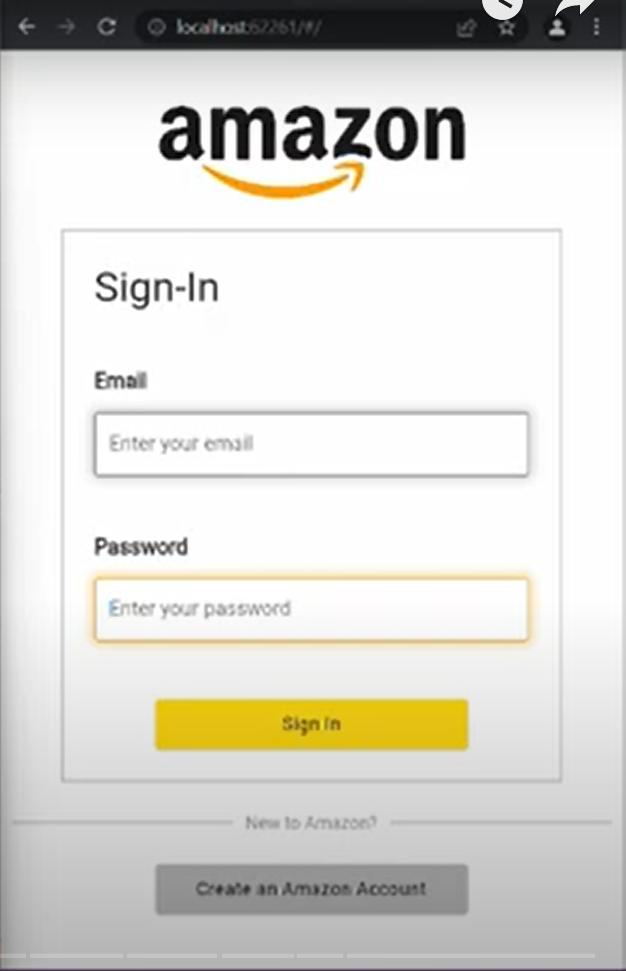

# Amazon Clone

Build a functional Amazon Clone with the cross-platform framework, Flutter, with the backend as Firebase- Works on Android and Web

## Features

- Email & Password Authentication
- Persistent Login
- View different products
- Search up for products
- Add rating and reviews to products
- Sell products
- Add products to cart
- Order products (Sends an order request to seller)
- Sign Out

